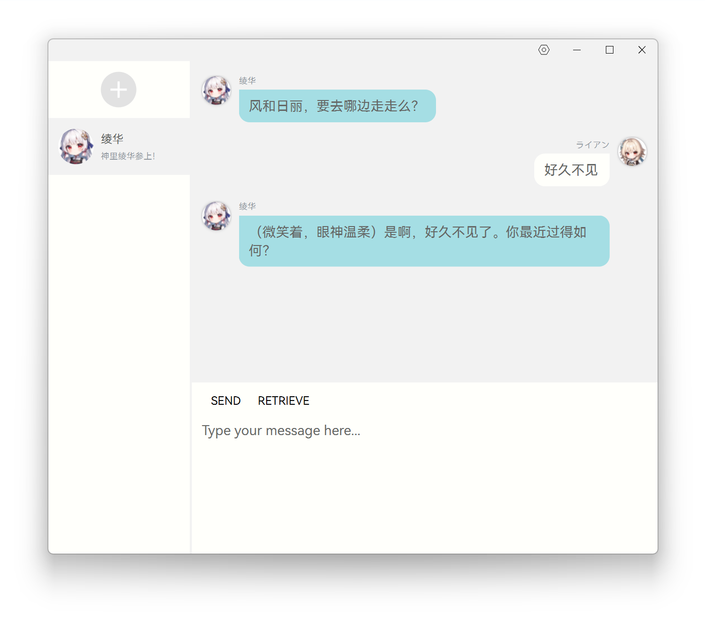

# AIChatGUI

[中文文档](README_zh.md) | [English Document](README.md)
## Screenshots

## What's this?
This is a GUI program that can be used to chat with chatgpt, and also generate speaking audio from text.
## How to use?
Clone this repo, and run `python3 app.py` in the terminal. This program is based on python3.10, so you need to install python 3.10.0 or higher version.

After opening the program, you need to perform initialization settings. After completing the settings, click `Save` to save the settings. Then click `+` to add a new chatbot and start chatting.
## What you need?
You need to install the following packages:
- `pip install openai`
- `pip install pyside6`
- `pip install requests`
- `pip install numpy`
- `pip install pandas`
- `pip install PySideSix-Frameless-Window`

Or, you can run `pip install -r requirements.txt`.

To generate audio, you need to install [nene-emotion](https://huggingface.co/spaces/innnky/nene-emotion/tree/main) or [vits-simple-api](https://github.com/Artrajz/vits-simple-api) and deploy it on your server or localhost. Then, you need to change the `VITS Setting` to your server address or localhost address.

To chat with chatgpt, you need to get a chatgpt api key from [here](https://api.chatgpt.com/). Then, you need to change the `OpenAI Setting` to your api key.

To translate text, you need to get a API access, only support[Baidu](https://api.fanyi.baidu.com/), [Google](https://cloud.google.com/translate/docs/reference/rest/), [Youdao](https://ai.youdao.com/product-fanyi-text.s), [DeepL](https://www.deepl.com/pro-api) and [ChatGPT](https://api.chatgpt.com/). Then, you need to change the `Translater Setting` to your api key.
## Features
- Chat with chatgpt
- Generate emotion audio from text
- Auto choose emotion

Use emotion-vits to generate audio, you can choose the emotion you want to express. But you can't choose the emotion automatically. So, I add a feature that can auto choose the emotion. This feature is based on [nene-emotion](https://huggingface.co/spaces/innnky/nene-emotion/tree/main). It can detect the emotion of the text, and choose the emotion that is most similar to the emotion of the text. This feature is not perfect, but it can work well in most cases.

Automatic emotion selection refers to the use of langchain’s prompt engineering method as a reference, utilizing the text’s embedding and contextual embedding to find the emotion that is closest to the target text.

## Progress
- [x] Basic UI
- [x] Chat with chatgpt
- [x] Generate audio from text, only tested vits-simple-api
- [x] Translate text, only tested DeepL API
- [ ] Export chat history and audio, multiple chat history for one chatbot
- [ ] Improve UI, e.g. add animation, theme, etc.
- [ ] Support more languages
- [ ] Support more chatbot
- [ ] Support more TTS models
- [ ] Support more translation API
- [ ] Consider adding Stable-Diffusion API to generate images
## Why I create this?
Just for fun.
## License
This program is licensed under the MIT License. See [LICENSE](LICENSE) for more details.

If you use this program, please star this repo. Thanks!

For Chinese users, you can read the Chinese version of the README [here](README_zh.md).